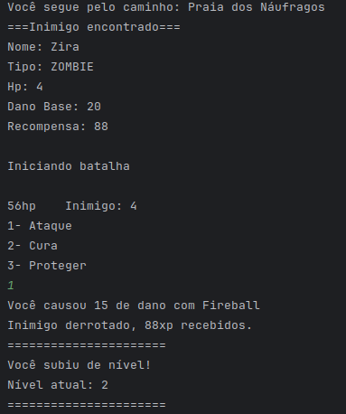
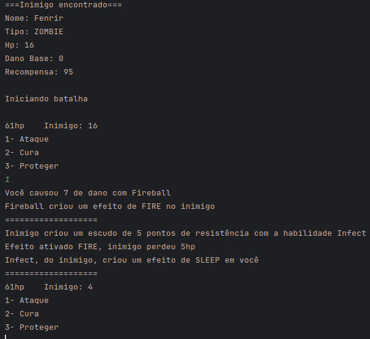
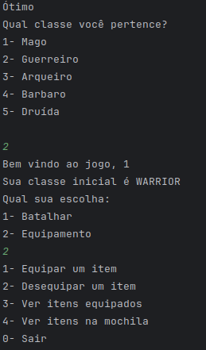
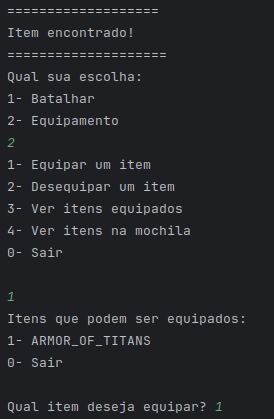
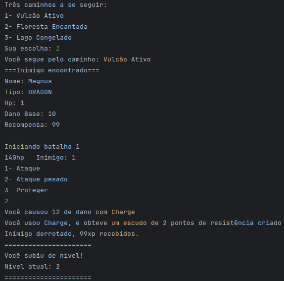

# RPG - Infinite Adventure
## Descrição
Este projeto é um jogo de RPG de turno simples, onde personagens e inimigos se enfrentam em batalhas por turnos. Cada personagem pode realizar ações como atacar, usar habilidades, defender ou fugir.

## Estrutura do Projeto
O projeto está organizado nos seguintes pacotes e classes:

### Pacote view
WindowGame: Classe principal que gerencia a interface do jogo.
### Pacote controller
BattleController: Controla as ações durante as batalhas.
GameController: Gerencia o fluxo geral do jogo, incluindo criação de personagens e inimigos.
### Pacote model
Character: Classe base para todos os personagens, contendo atributos comuns.
Enemy: Representa os inimigos no jogo.
Player: Representa os jogadores no jogo.
Item: Enumeração que define os itens disponíveis no jogo.
### Pacote model.types
EnemyType: Enumeração que define os tipos de inimigos.
PlayerType: Enumeração que define os tipos de jogadores.
### Pacote model.abilities
Effect: Enumeração que define os efeitos das habilidades.
Skill: Classe que define as habilidades que personagens e inimigos podem usar.

## Funcionalidades do Jogo
- Criação de Personagens:
- Personagem base com atributos como nome, pontos de vida, força e defesa.
- Classes derivadas como Guerreiro, Mago e Arqueiro com atributos específicos.
- Combate
- Sistema de turnos onde personagens e inimigos executam ações.
- Métodos para atacar, usar magia, defender e fugir.
- Cálculo de dano baseado nos atributos dos personagens.
- Classe Inimigo com atributos específicos como tipo e recompensa em experiência.
- Classe Habilidade com atributos como nome, tipo e dano base.
- Atributo Habilidades na classe Personagem, uma lista de habilidades.
- Método CalcularDano para verificar vantagens e fraquezas.

## Iniciando o projeto
Para iniciar o projeto você pode apertar no botão "run" em alguma IDE como Intellij, Eclipse ou pode execultar via terminal utilizando os comandos:
```
javac Main.java
```
O comando acima compila o projeto, para que o projeto inicie, use o comando abaixo:
```
java Main
```
Com esse comando o jogo já iniciará, para facilitar, você pode iniciar o jogo também passando o nome de seu personagem seguido da classe:
```
java Main MagoBranco Guerreiro
```
Classes para inserir no terminal:
```
"MAGO", "MAGE", "GUERREIRO", "WARRIOR", "ARCHER", "ARQUEIRO", "BARBARO", "BARBARIAN", "DRUIDA", "DRUID"
```

## Imagens do projeto
### Batalha </br>


### Efeitos </br>


### Escolha de Classe Manual


### Novo Ítem


### Novo Nível
